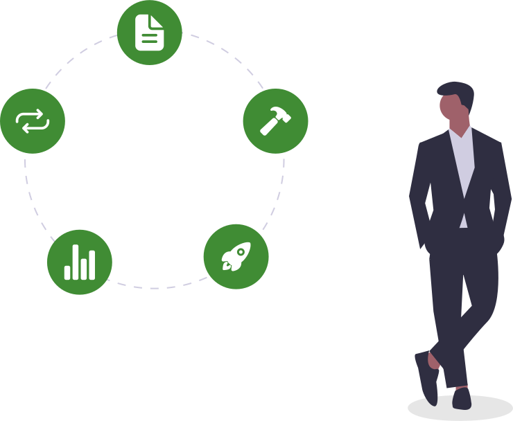

# 📚 </**GitHub Overview**>

```
                                                                                                                                                                                                                             
                                                                                                                                                                                                 bbbbbbbb                    
        CCCCCCCCCCCCChhhhhhh                                 iiii                            tttt            iiii                                                  GGGGGGGGGGGGG                 b::::::b              iiii  
     CCC::::::::::::Ch:::::h                                i::::i                        ttt:::t           i::::i                                              GGG::::::::::::G                 b::::::b             i::::i 
   CC:::::::::::::::Ch:::::h                                 iiii                         t:::::t            iiii                                             GG:::::::::::::::G                 b::::::b              iiii  
  C:::::CCCCCCCC::::Ch:::::h                                                              t:::::t                                                            G:::::GGGGGGGG::::G                  b:::::b                    
 C:::::C       CCCCCC h::::h hhhhh      rrrrr   rrrrrrrrr  iiiiiii     ssssssssss   ttttttt:::::ttttttt    iiiiiii   aaaaaaaaaaaaa  nnnn  nnnnnnnn          G:::::G       GGGGGG  aaaaaaaaaaaaa   b:::::bbbbbbbbb    iiiiiii 
C:::::C               h::::hh:::::hhh   r::::rrr:::::::::r i:::::i   ss::::::::::s  t:::::::::::::::::t    i:::::i   a::::::::::::a n:::nn::::::::nn       G:::::G                a::::::::::::a  b::::::::::::::bb  i:::::i 
C:::::C               h::::::::::::::hh r:::::::::::::::::r i::::i ss:::::::::::::s t:::::::::::::::::t     i::::i   aaaaaaaaa:::::an::::::::::::::nn      G:::::G                aaaaaaaaa:::::a b::::::::::::::::b  i::::i 
C:::::C               h:::::::hhh::::::hrr::::::rrrrr::::::ri::::i s::::::ssss:::::stttttt:::::::tttttt     i::::i            a::::ann:::::::::::::::n     G:::::G    GGGGGGGGGG           a::::a b:::::bbbbb:::::::b i::::i 
C:::::C               h::::::h   h::::::hr:::::r     r:::::ri::::i  s:::::s  ssssss       t:::::t           i::::i     aaaaaaa:::::a  n:::::nnnn:::::n     G:::::G    G::::::::G    aaaaaaa:::::a b:::::b    b::::::b i::::i 
C:::::C               h:::::h     h:::::hr:::::r     rrrrrrri::::i    s::::::s            t:::::t           i::::i   aa::::::::::::a  n::::n    n::::n     G:::::G    GGGGG::::G  aa::::::::::::a b:::::b     b:::::b i::::i 
C:::::C               h:::::h     h:::::hr:::::r            i::::i       s::::::s         t:::::t           i::::i  a::::aaaa::::::a  n::::n    n::::n     G:::::G        G::::G a::::aaaa::::::a b:::::b     b:::::b i::::i 
 C:::::C       CCCCCC h:::::h     h:::::hr:::::r            i::::i ssssss   s:::::s       t:::::t    tttttt i::::i a::::a    a:::::a  n::::n    n::::n      G:::::G       G::::Ga::::a    a:::::a b:::::b     b:::::b i::::i 
  C:::::CCCCCCCC::::C h:::::h     h:::::hr:::::r           i::::::is:::::ssss::::::s      t::::::tttt:::::ti::::::ia::::a    a:::::a  n::::n    n::::n       G:::::GGGGGGGG::::Ga::::a    a:::::a b:::::bbbbbb::::::bi::::::i
   CC:::::::::::::::C h:::::h     h:::::hr:::::r           i::::::is::::::::::::::s       tt::::::::::::::ti::::::ia:::::aaaa::::::a  n::::n    n::::n        GG:::::::::::::::Ga:::::aaaa::::::a b::::::::::::::::b i::::::i
     CCC::::::::::::C h:::::h     h:::::hr:::::r           i::::::i s:::::::::::ss          tt:::::::::::tti::::::i a::::::::::aa:::a n::::n    n::::n          GGG::::::GGG:::G a::::::::::aa:::ab:::::::::::::::b  i::::::i
        CCCCCCCCCCCCC hhhhhhh     hhhhhhhrrrrrrr           iiiiiiii  sssssssssss              ttttttttttt  iiiiiiii  aaaaaaaaaa  aaaa nnnnnn    nnnnnn             GGGGGG   GGGG  aaaaaaaaaa  aaaabbbbbbbbbbbbbbbb   iiiiiiii
                                                                                                                                                                                                                             
```


<div align="center">
  ">
</div>


## 👋🏾 </ Hello there, Christian here! Welcome! >

You’re looking at a quick snapshot of what I build, why I do it, and how you can get involved.
Grab a coffee ☕️, read on, and feel free to reach out if something sparks curiosity!

---

## 🏗️ </ Project Highlights >

| Feature | Description |
|---------|-------------|
| **Languages** | [](https://skillicons.dev) |
| **Frameworks** | [](https://skillicons.dev) |
| **Tools** | [](https://skillicons.dev) |
| **Open‑Source** | Working on it 😅 |

> *I love turning ideas into code that solves real problems.*

---

## 📖 </ About Me >

- **Full‑stack developer** with a passion for clean architecture.  
- **Open‑source enthusiast** – contributing to tooling, libraries, and docs.  
- **Linux fanatic** – running a tweaked Linux OS. **_I use Arch BTW_** 

[](https://skillicons.dev)

> *“Technology is poetry; Linux is my stage.”* — *Me* 😅

---

## 🚀 </ Key Projects >

### 1️⃣ **iContribute.ts API** (📦 Express + TS)  
A tiny service that lists all contributors to a repo, automatically pulling Git history and allowing custom entries.  
[🔗 Repo](https://github.com/christian80gabi/icontribute.ts)

### 2️⃣ **christian80gabi.com** (🎨 Portfolio)  
My portfolio 🐳
[🔗 Repo](christian80gabi.com)

### 3️⃣ **Recycle AI** (♻️ Django + React)  
A waste management & recycling copilot addressing a solution at some of the Sustainable Development Goals (SDGs) from the UN SDGs.
[🔗 Repo](https://github.com/christian80gabi/RecycleAI)

### 4️⃣ Square Game (♟️ React + Expo)
A simple board game which the goal is to create squares with dots.
[🔗 Repo](https://github.com/christian80gabi/squaregame)

### 5️⃣ Hyprland Dotfiles (🐧 Linux Config + Hyprland)
A set of config files for a Hyprland environment ready after installing Arch Linux or OpenSUSE
[🔗 Repo](https://github.com/christian80gabi/hyprland-dotfiles)

### 6️⃣ FullCalendar-Django (📆 Django + FullCalendar)
An Agenda-like build using Django as server and FullCalendar JS library for the interface
[🔗 Repo](https://github.com/christian80gabi/fullcalendar_django)

### 7️⃣ PiWord (🆕 .Net Maui)
A simple word game where you learn news words everyday or at every refresh.
[🔗 Repo](https://github.com/christian80gabi/PiWord)

---

## 📦 </ How to Use My Repos >

1. **Clone**: `git clone <repo-url>`  
2. **Install**: `npm i` (or `yarn`, `pnpm`)  
3. **Run**: `npm run dev` / `docker compose up` – check the README for specifics.

> *This is for `javascript/TypeScript` projects. So...*

---

## 🛠️ </ Tech Stack & Tools >

<p align="center">
  <a href="https://skillicons.dev">
    
  </a>
</p>


> *My workflow blends modern tooling with a sprinkle of nostalgia for classic scripting.*

---

## 🫵🏾 </ Get Involved >

- **Contribute**: Pick an issue labeled “good first issue” or open a PR.  
- **Suggest Features**: Open an issue on the relevant repo.  
- **Ask Questions**: Reach out via GitHub Discussions or Discord (link below).  

> *I’m always excited to collaborate with fellow developers!*

---

## 📬 </ Contact & Social >

| Platform | Link |
|----------|------|
| [](https://skillicons.dev) | [linkedin.com/in/christian-gabriel-nana](https://www.linkedin.com/in/christian-gabriel-nana) |
| [](https://skillicons.dev) | [@christian80gabi](https://twitter.com/christian80gabi) |

---

```

__/\\\\\\\\\\\\\\\__/\\\_______________________________________________________________/\\\________/\\\_____________________________        
 _\///////\\\/////__\/\\\_______________________________________/\\\___________________\///\\\____/\\\/______________________________       
  _______\/\\\_______\/\\\______________________________________\/\\\_____________________\///\\\/\\\/________________________________      
   _______\/\\\_______\/\\\__________/\\\\\\\\\_____/\\/\\\\\\___\/\\\\\\\\__________________\///\\\/__________/\\\\\_____/\\\____/\\\_     
    _______\/\\\_______\/\\\\\\\\\\__\////////\\\___\/\\\////\\\__\/\\\////\\\__________________\/\\\_________/\\\///\\\__\/\\\___\/\\\_    
     _______\/\\\_______\/\\\/////\\\___/\\\\\\\\\\__\/\\\__\//\\\_\/\\\\\\\\/___________________\/\\\________/\\\__\//\\\_\/\\\___\/\\\_   
      _______\/\\\_______\/\\\___\/\\\__/\\\/////\\\__\/\\\___\/\\\_\/\\\///\\\___________________\/\\\_______\//\\\__/\\\__\/\\\___\/\\\_  
       _______\/\\\_______\/\\\___\/\\\_\//\\\\\\\\/\\_\/\\\___\/\\\_\/\\\_\///\\\_________________\/\\\________\///\\\\\/___\//\\\\\\\\\__ 
        _______\///________\///____\///___\////////\//__\///____\///__\///____\///__________________\///___________\/////______\/////////___


```
---

🫰🏾 Thanks for stopping by!  
If you like what you see, consider starring a repo or following me on social media.  
Let’s keep building awesome stuff together! 🚀

---

## 📄 </ License >

This README is released under the **MIT License** – feel free to adapt it for your own profile.  
See the [LICENSE](LICENSE) file in each repo for project‑specific terms.

---

Made with care • © Christian Gabi
